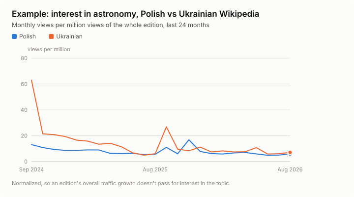
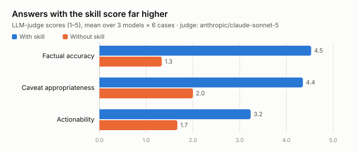
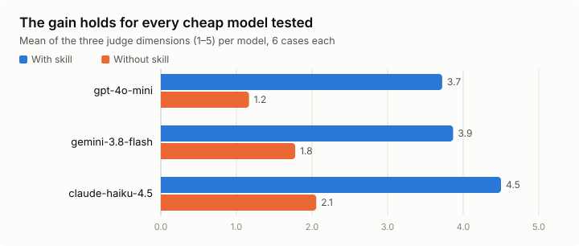

# Wikipedia Trends skill

An Agent Skill that helps B2C product teams decide **which topic to build next
and which language to launch in**, using real Wikipedia pageview data. Ask a
question in plain language; the agent fetches data from Wikimedia, analyzes the
trend, tells you how far to trust it, and can produce a one-page PDF report you
can share.

> Pageviews measure interest in an article, not willingness to pay. Treat the
> output as a signal for what to validate next, not a decision by itself.



This is the kind of trend the skill works from, here with real data for
astronomy in Polish and Ukrainian Wikipedia. The skill turns it into numbers
with caveats. In this case: down about 5% year over year in both editions,
with a spike month in each, so neither is a reliable growth story. See the
[example one-page report](assets/example-report.pdf) it generates.

## What you can ask

- "Compare growth of interest in intermittent fasting in Polish and Czech
  Wikipedia over the last two years."
- "We're thinking about adding an astronomy course. Is interest growing in
  Ukrainian Wikipedia, and how much can we trust that?"
- "Compare interest in learning English across Polish, Czech, Ukrainian, German
  and Spanish Wikipedia and tell us which audiences to investigate next."
- Follow-ups work too: "now add Polish and extend to 3 years" reuses cached data.

## Requirements

- Node.js 20 or newer
- Internet access (Wikimedia and Wikidata public APIs, no API keys needed)

## Setup

Run every command in this README from this folder, the skill directory.

```bash
npm install
npm run build
```

## Using it with an agent

This folder is a self-contained [Agent Skill](https://agentskills.io/specification):
`SKILL.md` teaches the agent the workflow, and a plain Node CLI does the data
work, so any agent that can run shell commands can use it. Agents discover
skills by folder, so install it by copying this folder into your agent's
skills directory, then run the setup above in the copy:

```bash
cp -r wikipedia-trends ~/.claude/skills/    # Claude Code
cp -r wikipedia-trends ~/.agents/skills/    # Codex, Cursor, Gemini CLI, Copilot
```

For a single project, use `<project>/.claude/skills/` or
`<project>/.agents/skills/` instead. Agents that read `AGENTS.md` also work
when started inside this folder: `AGENTS.md` points them at `SKILL.md`.

Tips for good answers:

- Name the topic and the language editions, for example "in Polish and Czech
  Wikipedia". Language codes are Wikipedia's own prefixes (`pl`, `cs`, `uk`,
  `de`, `es`, ...).
- Ask about trust explicitly ("how much can we trust this?"); the agent will
  foreground the confidence flags below.
- If a topic name is ambiguous (for example "Mercury"), the agent should tell
  you which meaning it used. If it does not, say so and ask it to re-check.

## Test it yourself

Work through these in order; each step checks more of the system than the last.

**1. The code works (1 minute, no API keys).**

```bash
npm install && npm run build
npm test                                   # 28 unit tests, no network
node dist/cli.js analyze-and-report --topic "astronomy" --langs uk,pl --out test.pdf
```

The last command hits the live Wikimedia API. It should print JSON with growth
numbers and flags, and write `test.pdf`. Open the PDF and check it has two
charts and an "Assumptions & limitations" section.

**2. An agent uses it (Claude Code).** Install the skill as described in
[Using it with an agent](#using-it-with-an-agent), start Claude Code in any
folder and switch to the cheap model the brief targets:

```
claude
/model haiku
```

Then ask one of the questions from [What you can ask](#what-you-can-ask). What
to look for in the answer:

- It ran `node dist/cli.js ...` commands rather than answering from memory.
- The numbers it quotes match the JSON the CLI printed.
- It names the confidence flags that apply (for example, a spike month) instead
  of presenting a noisy trend as certain.
- It wrote a PDF when you asked for a report.

Then try the edge cases:

- **Ambiguous topic:** "Is interest in Mercury growing in German Wikipedia?"
  It should say which Mercury it analyzed.
- **Small edition:** "Is interest in chess growing in Icelandic Wikipedia?" It
  should warn that the numbers are noisy.
- **Follow-up:** after any answer, "now add Polish and extend to 3 years." It
  should reuse the earlier data rather than start from scratch.

**3. Compare against no skill.** Ask the same question somewhere the skill is
not available, for example claude.ai or Claude Code in another folder. The
answer will be generic and have no real numbers. That gap is what the
benchmark below measures.

**4. Other agents.** Install the skill into `~/.agents/skills/` and open any
project in Cursor or Codex. Ask the same questions and check the same things.

**5. Automated, on any model.** The eval harness drives a model through the
same scenarios and scores it. To test a single model on a single case:

```bash
EVAL_MODELS=anthropic/claude-haiku-4.5 npx tsx eval/run.ts astronomy-trust
```

See [Evaluation benchmark](#evaluation-benchmark) for setup.

## Using the CLI directly

```bash
# One shot: resolve, analyze, and write a one-page PDF
node dist/cli.js analyze-and-report \
  --topic "astronomy" --langs uk,pl --months 24 --out astronomy.pdf

# Other subcommands (each supports --help)
node dist/cli.js resolve-topic --topic "Mercury" --langs de
node dist/cli.js analyze        --topic "astronomy" --langs uk --months 24
node dist/cli.js compare        --topics "astronomy,chess" --langs uk,pl
node dist/cli.js report         --from analysis.json --out report.pdf
```

All commands print JSON to stdout; failures print one `Error: ...` line to
stderr with a non-zero exit code. Results are cached on disk for 24 hours, so
repeated or overlapping queries are fast.

## Reading the results

Every series carries confidence flags. The report's "Assumptions & limitations"
section is generated from them.

| Flag | Meaning |
|---|---|
| `shortHistory` | Less data than the window you asked for; too young to call a trend. |
| `lowVolume` | Very low traffic; month-to-month noise likely dominates. |
| `hasSpike` | An outlier month, often a news event rather than sustained interest. |
| `hasGaps` | Months with zero recorded views. |
| `trailingMonthLikelyIncomplete` | The latest month looks unprocessed by Wikimedia; it is excluded from growth figures. |

Growth is reported raw and also normalized as a share of the whole language
edition's traffic, so a growing edition does not masquerade as growing interest
in your topic. Prefer the normalized numbers when comparing languages.

## How well it works

We ran each of 6 scenarios (the three questions above, an ambiguous topic, a
small language edition, and a follow-up) on three cheap models, once with the
skill and once without, and scored every answer. See
[Evaluation benchmark](#evaluation-benchmark) for how.



| Metric | With skill | Without skill |
|---|---|---|
| Factual accuracy (judge, 1–5) | 4.5 | 1.3 |
| Caveat appropriateness (judge, 1–5) | 4.4 | 2.0 |
| Actionability (judge, 1–5) | 3.2 | 1.7 |
| Answer grounded in fetched data | 94% | 0% |
| Stated trend direction matches real data | 15 of 15 | 0 of 14 |
| Runs | 18 | 18 |

The direction row is the starkest. Most of these topics are declining year over
year. Without the skill, models answered from memory, said "growing", and were
wrong every time they stated a direction.



| Model | With skill | Without skill |
|---|---|---|
| gpt-4o-mini | 3.7 | 1.2 |
| gemini-3.8-flash | 3.9 | 1.8 |
| claude-haiku-4.5 | 4.5 | 2.1 |

Judge: `anthropic/claude-sonnet-5`, which is not one of the models under test.
Actionability is the weakest dimension even with the skill: answers state the
trend and its caveats well but are less specific about next steps. Source run:
`eval/results/2026-09-27T10-16-46-034Z`.

## Development

```bash
npm test          # unit tests, no network needed
npm run build     # compile scripts/ to dist/
```

### Evaluation benchmark

`eval/` measures how well cheap models use the skill, comparing runs with and
without it. It needs an OpenRouter key:

```bash
echo "OPENROUTER_API_KEY=sk-or-..." > .env     # git-ignored
npm run eval                                    # full matrix
npx tsx eval/run.ts astronomy-trust             # a single case
```

Environment variables: `EVAL_MODELS` (comma-separated OpenRouter model ids),
`JUDGE_MODEL`, and `EVAL_SKIP_JUDGE=true` to skip the LLM judge.

Scoring has three tiers: deterministic checks against ground truth computed
independently from live data, rubric checks (ambiguity disclosure, flags
surfaced), and an LLM judge scoring factual accuracy, caveat appropriateness and
actionability. Results are written to `eval/results/`.

After a new run, regenerate the charts and example report in `assets/` with
`npm run docs:charts`. It uses the latest judged results file and live data for
the example.

Warning: the eval lets a remote model run shell commands through a bash tool
guarded only by a denylist, with no container isolation. Run it supervised, on a
machine you are comfortable with.

## More documentation

- `ARCHITECTURE.md`: design decisions
- `MILESTONES.md`: build plan and status
- `FUTURE_WORK.md`: known limitations and how to extend the skill
- `SKILL.md`: the agent-facing workflow
